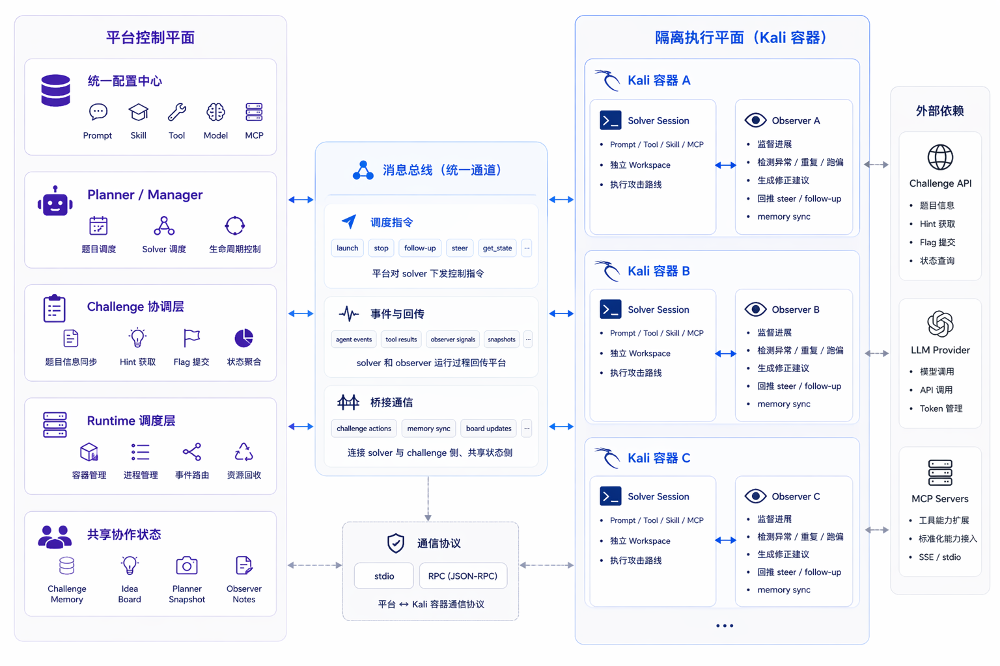

# BreachWeave

BreachWeave（`tch-agent`）是面向**授权渗透测试与攻防演练**的多 Agent 协作系统。多个 Solver 在隔离 Kali 环境中并行推进 kill chain，由编排中枢统一调度、旁路 Observer 维护作战态，Commander 与 Planner 分别承担人机协同与自动调度。

## 第一次启动

```bash
bun run install && bun run web
```

部署与 scope 配置见 [docs/deployment.md](docs/deployment.md)、[docs/engagement-mode.md](docs/engagement-mode.md)。完整工程说明见 [ARCHITECTURE.md](ARCHITECTURE.md)。



## 架构核心

项目采用 **编排中枢 / Solver / Observer** 多角色架构。

### 编排中枢（ChallengeManager）

负责全局编排，**不亲自执行利用链**，而是站在**目标（target）**视角做统一调度：

- 管理多目标推进节奏与优先级
- 分配、回收、纠偏 Solver
- 汇总运行状态与 findings
- 维护跨 Solver 共享作战态（memory / ideas / state assets）

可以把它理解成整套系统的控制平面。

### Solver

真正在 Kali 容器（或远程 SSH 主机）里执行 kill chain 的主体，面向具体攻击路线推进：

- 信息收集与资产测绘
- 漏洞验证与利用链推进
- 通过 `report_finding` 记录已验证发现
- 通过 `record_asset` 沉淀可复用资产

一个目标可同时运行多个 Solver，并行探索不同方向。

### Observer

不直接代替 Solver 做决策，而是作为**旁路监督 sidecar** 持续观察执行过程，解决复杂任务里常见的问题：

- 执行路径逐渐偏移
- 状态累积后变得混杂
- 模型在阶段性停顿时过早结束任务
- 上下文越来越重，稀释后续决策信号

Observer 维护 solver 本地策略看板（ideas / memory），并在必要时通过 steer 做轻量纠偏。

## 系统能力概览

### 1. 多 Agent 协作

多个 Solver 并发探索不同方向，由 Planner / Commander 在全局视角统一调度，避免重复试错，并让有效结果继续沉淀和复用。

### 2. 运行态监督

Observer 持续检查最近几轮执行轨迹，不替代 Solver 做决定，而是在发现明显低效或偏移时进行轻量纠偏。

### 3. 状态分层维护

系统把「方向」和「事实」拆开维护：

- **思路（ideas）** — 当前值得继续验证的假设与路线
- **记忆（memory）** — 可复用的事实、证据与约束

避免状态混在一起，导致后续决策越来越模糊。

### 4. 结束条件外置

任务是否结束，不完全交给模型主观判断：续跑机制结合目标完成状态统一约束；关键发现经 Verifier 复验后，才由系统收尾。

### 5. 上下文压缩与降噪

大体积工具输出落盘到 workspace，上下文只保留预览与路径指引，让后续决策建立在高信号、低噪音的信息之上。

## 实战模式

系统**默认以实战（engagement）模式运行**：通过 scope 白名单约束授权范围，findings 写入本地日志，完成判定依赖操作员或 Verifier 确认，**不连接任何远程评分平台**。

详见 [docs/engagement-mode.md](docs/engagement-mode.md)。
