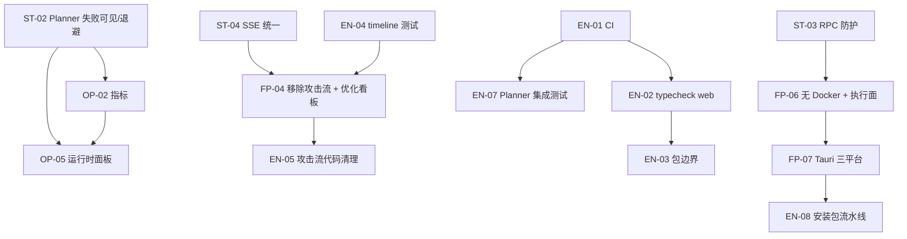
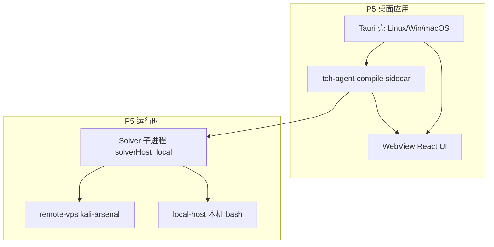

# BreachWeave 改进计划（草案）

> **用途**：汇总「功能与产品设计」「稳定性与可靠性」「工程与可维护性」「运维与可观测性」四个维度的待改进项，供评审后做减法与排期。  
> **范围**：本文**不包含**「安全与合规」类改进（认证、作战范围硬拦截、密钥治理等），另立文档处理。  
> **状态**：v0.5 — 已拍板项见 §2、§9；**桌面应用 + 无 Docker 终局形态见 §11（最后做，单独排期）**  
> **关联**：[项目文档.md](项目文档.md)、[配置手册.md](配置手册.md)、[ARCHITECTURE.md](../ARCHITECTURE.md)

---

## 1. 如何使用本文档

1. 通读 **§2 总览表**，对每条标记：`必做` / `可选` / `不做` / `延后`。
2. 在 **§2** 的「你的决定」列填写意见（可直接在 Markdown 里改）。
3. 删减后把保留项按 **§8 建议分期** 调整顺序；不需要的分期可整段删除。
4. 定稿后再进入实现；实现时以各条的 **验收标准** 为 Done 定义。
5. **§11 终局形态（P5）勿与 P1–P3 混在同一单次任务/PR**，按子阶段拆开交付。

**实施顺序（总览）**

| 阶段 | 主题 | 何时做 |
|------|------|--------|
| **P1** | 规则、Planner、CI、health | 先做 |
| **P2** | 作战看板、情报、SSE、测试债 | 其次 |
| **P3** | NVD、Planner 集成测等长期质量 | 再次 |
| **P5** | 无 Docker 本机 Solver + 双执行面 + **三平台桌面应用** | **最后做** |

> P4 已取消（原「大脑上 VPS」不做）。P5 内部再拆 P5-A～F，见 §11。

**编号规则**

| 前缀 | 维度 |
|------|------|
| FP | 功能与产品设计 |
| ST | 稳定性与可靠性 |
| EN | 工程与可维护性 |
| OP | 运维与可观测性 |

**工作量**：S（≤1 人日）、M（2–5 人日）、L（1–2 周）、XL（>2 周）

---

## 2. 总览表（减法入口）

| ID | 标题 | 工作量 | 建议期 | 状态 |
|----|------|--------|--------|------|
| FP-01 | 强制执行「同时 running 目标 ≤ 3」 | S | P1 | **已完成**（core + slots API + 列表 Banner） |
| FP-02 | Planner 可在配置/UI 中关闭 | M | — | **不做** |
| FP-03 | TUI 控制面：恢复或正式下线 | L | — | **不做** |
| FP-04 | 移除攻击流，优化作战看板 | M | P2 | **已完成** |
| FP-05 | Engagement 结构化情报注入 | M | P2 | **已完成** |
| FP-06 | 本机 Solver（无 Docker）+ 执行面 VPS/本机可切换 | XL | **P5** | **待做**（类型骨架已加，见 [P5-实施计划.md](P5-实施计划.md)） |
| FP-07 | 桌面应用：Tauri 壳 + WebView（Linux/Win/macOS） | XL | **P5** | **待做** |
| ST-01 | Verifier 不可用时的收工与降级策略 | M | P1 | **已完成**（自动重试 + 跳过验证可配置，默认 verifierRequired=true） |
| ST-02 | Planner tick 失败可见化与熔断 | M | P1 | **已完成** |
| ST-03 | JSONL RPC stdout 污染防护 | M | P2 | **已完成** |
| ST-04 | 统一 SSE 断线恢复与陈旧数据提示 | M | P2 | **已完成** |
| ST-05 | NVD / 漏洞情报查询可靠性 | M | P3 | **已完成**（core + MCP 对齐） |
| EN-01 | 最小 CI 流水线 | S | P1 | **已完成** |
| EN-02 | `ui-web` / `apps/cli` 纳入 typecheck | M | P1 | **已完成** |
| EN-03 | 消除 `ui-web` 对 `core/src` 相对路径直连 | M | P2 | **已完成** |
| EN-04 | `attack-timeline` 单元测试 | M | P2 | **已完成** |
| EN-05 | 移除攻击流相关代码与 API 清理 | M | P2 | **已完成** |
| EN-06 | 作战看板 / progress API 测试 | S | P2 | **已完成** |
| EN-07 | Planner 集成冒烟测试（mock LLM） | L | P3 | **已完成** |
| OP-01 | `/health` / `/ready` 健康检查端点 | S | P1 | **已完成** |
| OP-02 | 结构化运行指标（计数 + 可选 Prometheus） | M | P2 | **已完成** |
| OP-03 | 修正 `deploy/` 与文档引用一致性 | S | P1 | **已完成** |
| OP-04 | Docker 资源限制默认值与超限提示 | S | P2 | **已完成**（推荐值 + 宿主机探测 + 无限制 Badge） |
| OP-05 | 运行时状态面板增强（Planner/Solver 健康） | M | P2 | **已完成** |
| EN-08 | 三平台安装包构建（AppImage/deb/dmg/exe） | L | **P5** | **待做**（随 FP-07） |

---

## 3. 功能与产品设计

### FP-01 强制执行「同时 running 目标 ≤ 3」

**现状**  
`MAX_ACTIVE_CHALLENGES = 3` 仅写入 Planner 快照（`manager.ts`），`startChallenge` / `planner_start_challenge` / UI「启动」路径**不检查**当前 running 数量。文档 §2.1 与 Planner 工具描述存在「可绕过」 gap。

**目标**  
任何启动目标实例的入口在超限时返回明确错误，Planner 与人工操作行为一致。

**方案要点**

- 在 `ChallengeManager.startChallenge` 入口统计 `instanceStatus === "running"`（或等价字段）的数量。
- 超限时返回结构化错误：`{ ok: false, error: "max_active_challenges", limit: 3, running: [...] }`。
- UI 目标列表 / 详情「启动」按钮展示禁用原因；Planner 工具结果写入 round 日志便于复盘。
- 可选：`HostSettings.challenge.maxActiveChallenges` 可配置，默认 3。

**涉及文件**

- `packages/core/src/challenge/manager.ts`
- `packages/ui-web/src/components/challenge/page.tsx`（及列表页若有启动入口）
- `docs/项目文档.md` §2.1（若改为可配置）

**验收标准**

- 已有 3 个 running 目标时，第 4 次 `startChallenge` 失败且消息可读。
- Planner `planner_start_challenge` 同样被拒绝，不会静默失败。
- 单元测试覆盖边界：2→3 成功，3→4 失败。

**工作量**：S  
**依赖**：无  
**风险**：若「paused」仍算 running，需与产品定义一致（建议：仅 `running` 计数，`paused` 不占槽）。

---

### FP-02 Planner 可在配置/UI 中关闭 — **不做**

**决定**：周期性调度**始终交给 Planner Agent**，不提供人工关闭/暂停 Planner 的开关。操作员通过 **Commander** 下达意图；**配置页仅保留** `tickIntervalMs`、`maxSolvers` 等参数，无 `enabled` 开关。

**产品含义**

- 与现网一致：`getHostSettings` 继续强制 `planner.enabled: true`。
- 人工干预路径：Commander 对话、`launch_solver` / `stop_solver`、目标级暂停测试等，而非停掉 Planner 循环。

---

### FP-03 TUI 控制面 — **不做**

**决定**：不实现终端版指挥台；控制面仅 Web UI。

**收尾（可选，非必须）**

- 若仍保留 `bun run tui` 脚本，应改名或删除，避免误导。
- `packages/ui-tui` **保留**：仅用于 `tch-agent solver` 本地调试时的 Solver 终端界面，与指挥台无关。

---

### FP-04 移除攻击流，优化作战看板

**现状**  
目标详情同时存在 **作战看板**（摘要 + SSE）与 **攻击流**（独立全屏页：ReactFlow 时间线回放）。两套 UI、两套 SSE（`/progress/stream` 与 `/attack-timeline/stream`），维护成本高；操作员主要需要「当前打到哪里了」，不需要复杂图形回放。

**目标**  
**去掉攻击流**；把实时进度、动态、phase、思路/记忆摘要集中在作战看板，作为唯一进度视图。

**方案要点**

**移除攻击流（EN-05 同步）**

- 删除 `attack-flow.tsx`、`AttackFlowPage` 路由（`#/challenge/:id/attack-flow`）。
- 目标详情页、作战看板内移除「攻击流」按钮与跳转。
- 评估并移除仅服务攻击流的 API/SSE：`/attack-timeline`、`/attack-timeline/stream`（若作战看板 `recentEvents` 仍依赖 `buildChallengeAttackTimeline`，**保留 core 聚合函数**，只删前端与多余 HTTP 通道）。
- 删除 `broadcastChallengeTimeline` 等仅推送攻击流的广播（若 progress board 已覆盖）。

**作战看板优化（本项重点）**

- **最新动态**：可展开查看 summary；按 lane（solver / observer / submission）分组或筛选。
- **时间感知**：显示 `updatedAt` /「X 秒前更新」；配合 ST-04 断线重连提示。
- **指挥条**：phase、battlePlan、plannerSummary 更醒目；失败/暂停状态 Banner。
- **思路 / 记忆**：看板内卡片信息密度与跳转（点到「思路」「记忆」Tab）优化。
- **SSE 单通道**：仅保留 `/progress/stream`，减少连接数。

**涉及文件**

- `packages/ui-web/src/components/challenge/operations-board.tsx`（主改）
- `packages/ui-web/src/components/challenge/page.tsx`
- `packages/ui-web/src/app.tsx`
- `packages/ui-web/src/server.ts`
- 删除：`packages/ui-web/src/components/challenge/attack-flow.tsx`
- 可选保留：`packages/core/src/challenge/attack-timeline.ts`（供 `buildProgressDigest` 的 `recentEvents`）

**验收标准**

- UI 中无任何「攻击流」入口；旧 hash URL 可重定向到目标详情作战看板 Tab。
- 作战看板在 9 会话 / 大目标场景下加载稳定（无 500）。
- 实时更新、phase、recentEvents、ideas/memory 摘要满足日常指挥需求。
- 文档更新：进度只看作战看板。

**工作量**：M  
**依赖**：ST-04（SSE 统一，建议与看板优化同做）

---

### FP-05 Engagement 结构化情报注入

**这是什么（通俗说）**  
渗透项目开始前，甲方或指挥员通常会给你一段**固定背景**，例如：

- 授权范围说明、业务上下文  
- 已知入口 URL、测试账号  
- 「别碰生产库」「只能从 VPN 进」等约束  
- 上一轮留下的侦察笔记  

这些在开战前就应该进 Agent 脑子，而不是等 Solver 自己猜或全靠 Commander 聊天口述。

**和现有字段的区别**

| | **描述 `description`** | **提示 `hint_content`** | **本项「情报 intel」** |
|---|---|---|---|
| 用途 | 目标是什么、要打什么 | 原 CTF 题 hint；Engagement 下 API 常为空 | 作战前人工给的**权威背景** |
| 谁写 | 注册目标时 | 平台下发（Engagement 无） | **操作员可编辑** |
| 何时用 | 启动时一次 | Solver 调 `challenge_get_hint` | 每次 launch / Planner 快照 |
| vs memory | — | — | memory 是**跑出来的发现**；intel 是**事先给的** |

UI 上目标详情已有只读「提示」区块（`hint_content`），Engagement 模式里通常是空的——本项本质是：**让操作员能写、能改、能注入**，并区分于运行中积累的 memory。

**现状**  
Engagement 下 `hint_content` 在 API 映射里被置为 `null`；Solver 没有稳定的「读初始情报」通道，只能靠 description + Commander 对话 + memory。

**目标**  
操作员在 Web 上维护「初始情报」，新 Solver / Planner 自动带上。

**方案要点**

- 字段：`intel_notes`（Markdown），或复用并激活 `hint_content` 的 Engagement 语义（实现时二选一，文档写清）。
- 目标详情可编辑「情报」区块（替换或补充现有只读「提示」）。
- `startChallenge` handoff、Planner snapshot、`challenge_get_state` 含情报摘要。
- 与 memory 严格区分：intel 不随 Solver 工具自动改写（除非操作员手动改）。

**涉及文件**

- `packages/core/src/challenge/store.ts`
- `packages/core/src/challenge/manager.ts`
- `packages/core/src/challenge/host-bridge-handler.ts`
- `packages/ui-web/src/components/challenge/page.tsx`

**验收标准**

- 保存情报后，新 launch 的 Solver 上下文可见摘要。
- Planner snapshot 含该目标情报片段。
- 可选：不做则继续用 description + memory 凑合。

**工作量**：M  
**依赖**：无  
**你的决定**：§2 总览表已标 **必做**（与指挥官 `create_target` / 目标详情编辑联动，见 §9 已拍板）。

---

### FP-06 本机 Solver（无 Docker）+ 执行面 VPS/本机可切换 — **P5，最后做**

**产品定稿（已拍板）**

- **大脑始终在本地控制面**（LLM + JSONL RPC），**不上 VPS**。
- **手脚（扫打命令）可配置**：远程 VPS（`kali-arsenal`）或本机（`bash` + 本机工具链）。
- 发行默认路径 **不再依赖 Docker**；Docker 保留为**兼容/开发**选项即可。

**现状**  
`ExecutionBackend` 仅有 `DockerBackend`；Prompt 强制打靶走 `kali-arsenal`；分发说明要求用户安装 Bun + Docker。

**目标**  
两个独立配置维度：

| 配置 | 字段（建议） | 值 |
|------|----------------|-----|
| Solver 宿主 | `tch.runtime.solverHost` | `local`（默认）\| `docker`（兼容） |
| 命令执行面 | `tch.runtime.execSurface` | `remote-vps`（默认）\| `local-host` |

**方案要点（P5-A / P5-B，勿与 FP-07 同 PR）**

**P5-A — `LocalProcessBackend`**

- 新增 `ExecutionBackend` 实现：`Bun.spawn` 本机 `tch-agent solver rpc`（或 compile 二进制），JSONL stdin/stdout 与现 `RuntimeManager` 一致。
- 会话目录仍为 `~/.tch-agent/solvers/<id>/`。
- `createExecutionBackend(config)` 按 `solverHost` 选择 `local` / `docker`。

**P5-B — `execSurface`**

- 启动 Solver 注入 `TCH_EXEC_SURFACE=remote-vps|local-host`。
- Prompt（`kimi-security` 等）按变量切换规则：`remote-vps` = 现状；`local-host` = 允许本机 `bash` 对授权目标扫打。
- Web **配置 → 运行时**：「命令执行位置：远程 VPS / 本机」。
- `local-host` 须配合 engagement scope 提示（硬拦截另见安全文档）。

**明确不做**

- Solver 大脑进程部署到远程 VPS（原 FP-06「SSH backend 跑 rpc」方案废弃）。

**涉及文件**

- `packages/core/src/runtime/execution-backend.ts`
- `packages/core/src/runtime/runtime.ts`
- `packages/core/src/config/types.ts`、`index.ts`
- `packages/ui-web/src/components/config/host.tsx`
- `packages/core/src/config/prompts/builtin/kimi-security.md` 等

**验收标准**

- `solverHost=local` 且无 Docker 时，可 launch Solver 并完成一轮工具调用。
- `execSurface=remote-vps` 行为与现网一致。
- `execSurface=local-host` 在本机工具可用时能对授权目标执行命令。
- `solverHost=docker` 仍可用（回归）。

**工作量**：XL（拆 P5-A + P5-B 各 M）  
**依赖**：ST-03 建议先于 P5-A 完成；P1–P3 功能稳定后再开工  
**排期**：**§11 P5，最后做**

---

### FP-07 桌面应用（Tauri + WebView，三平台）— **P5，最后做**

**产品定稿（已拍板）**

- 封装为**完整桌面应用**：双击运行，**不打开系统浏览器**。
- UI 仍为现有 React 指挥台，载入**应用内 WebView**。
- **Linux + Windows + macOS** 三平台均提供安装包。

**目标形态**

```
双击 BreachWeave
  → Tauri 壳（单实例、托盘、原生窗口）
  → spawn sidecar（bun compile 的 tch-agent 二进制）
  → WebView 加载 http://127.0.0.1:<随机端口>
  → 退出时停止 sidecar 与所有 Solver
```

**方案要点（P5-C～F，分 PR 交付）**

| 子阶段 | 内容 |
|--------|------|
| **P5-C** | `bun compile` 控制面单二进制；内嵌 runtime/mcp 资源路径约定 |
| **P5-D** | 新建 `apps/desktop/`（Tauri 2）：单实例锁、无地址栏窗口、退出收尾 |
| **P5-E** | 三平台 WebView 壳联调（Linux 优先，Win/macOS 跟进） |
| **P5-F** | 首次启动向导（API Key、VPS SSH、execSurface）；托盘菜单 |

**与现有一键脚本关系**

- **开发态**：保留 `scripts/start-breachweave.sh` + 浏览器（可选）。
- **发行态**：`.desktop` / 开始菜单指向 **AppImage / deb / dmg / exe**，不再依赖项目目录与 `bun install`。

**涉及文件**

- 新建 `apps/desktop/`（Tauri：`tauri.conf.json`、Rust 入口、sidecar 配置）
- `scripts/build.ts`、`scripts/pack-desktop.sh`（新建）
- `deploy/breachweave.desktop`（Exec 指向安装包内二进制）
- `docs/项目文档.md`、`docs/配置手册.md`

**验收标准**

- Linux：AppImage 或 deb 双击打开应用窗口，无外部浏览器。
- Windows：安装包/便携 exe 同上。
- macOS：dmg 签名前至少本地 ad-hoc 可运行。
- 重复双击聚焦已有窗口；退出后端口与 Solver 进程清理干净。
- 发行包**不要求**用户预装 Bun/Docker（`solverHost=local`）。

**工作量**：XL（拆 P5-C～F）  
**依赖**：FP-06 P5-A 完成；EN-08 与 P5-E 并行  
**排期**：**§11 P5，最后做；在 FP-06 之后**

---

## 4. 稳定性与可靠性

### ST-01 Verifier 不可用时的收工与降级策略

**现状**  
`verifyObjective` 在 Verifier session 不可用或模型配置错误时标记 `inconclusive`，且**不自动收工**。Solver 已报 objective 时，可能长期卡在「待验证」；操作员只能手动「确认完成」。

**目标**  
失败可感知、可恢复；在明确条件下允许受控降级，避免无限悬挂。

**方案要点**

- **可见性**：submission 记录展示 `verification_status` + 最近失败原因；目标详情 Banner 提示「验证者不可用」。
- **重试**：UI「重新验证」按钮；指数退避自动重试 N 次（可配置）。
- **降级策略**（需产品确认，默认关闭）：`HostSettings.challenge.verifierRequired = true`；为 `false` 时 `inconclusive` 超过 T 分钟可提示操作员「跳过验证并完成」。
- Verifier Prompt / 模型未配置时，启动阶段**前置检查**并阻断 launch（可选）。

**涉及文件**

- `packages/core/src/challenge/manager.ts`（`verifyObjective`）
- `packages/ui-web/src/components/challenge/page.tsx`
- `packages/core/src/config/types.ts`

**验收标准**

- 模拟 Verifier 失败时，UI 有明确状态，非静默 `inconclusive`。
- 重试可触发新一轮验证。
- 单元测试覆盖：成功 / 失败 / inconclusive / 重试。

**工作量**：M  
**依赖**：无

---

### ST-02 Planner tick 失败可见化与熔断

**现状**  
`startSyncLoop` 中 `tickPlanner` 抛错仅 `log`，然后 `setTimeout` 下一轮。API 持续故障时空转消耗配额，UI 无失败计数。

**目标**  
连续失败可被发现、可告警；**不**提供「关闭 Planner」能力（见 FP-02 不做）。

**方案要点**

- 内存态 `plannerHealth`：`lastOkAt`、`consecutiveFailures`、`lastError`。
- 连续失败 ≥ N（默认 5）→ **仅告警 + 可选指数退避拉长 tick 间隔**（loop 不停；不提供人工关停）。
- 暴露 API：`GET /api/planner/health`；运行时页 / 顶栏 Badge 显示异常（非「已暂停」开关态）。
- 成功后 `consecutiveFailures` 归零、tick 间隔恢复默认。
- 日志结构化字段便于 grep。

**涉及文件**

- `packages/core/src/challenge/manager.ts`
- `packages/ui-web/src/server.ts`
- `packages/ui-web/src/components/config/host.tsx`

**验收标准**

- 连续 mock 失败 5 次后 UI 显示告警与最近错误；tick 可退避但**不**永久停止调度。
- 下一轮成功后 `consecutiveFailures` 归零。
- 无「启用/关闭 Planner」UI 控件。

**工作量**：M  
**依赖**：无

---

### ST-03 JSONL RPC stdout 污染防护

**现状**  
Solver RPC 要求子进程 **stdout 仅 JSONL**；任何 `console.log`、MCP 库 stderr 误入 stdout 会导致 `runtime.ts` 解析失败、Solver 失联。架构文档 §8.2 有说明但缺少工程防护。

**目标**  
降低误输出导致的失联概率；污染发生时快速定位。

**方案要点**

- Solver 子进程入口：重定向 `console.log` 到 stderr 或文件（`packages/core/src/solver/`）。
- JSONL 解析器：对非 JSON 行记录 `rpc_stdout_pollution` 指标 + 最近一条脏行样本（截断）。
- 容器 entrypoint：环境变量 `TCH_RPC_STRICT=1` 时，连续 N 行解析失败后主动退出容器（可重启）。
- 开发文档：MCP / 扩展禁止 stdout 的 checklist。

**涉及文件**

- `packages/core/src/runtime/runtime.ts`
- `packages/core/src/solver/rpc-server.ts`（或等价入口）
- `ARCHITECTURE.md` §8.2

**验收标准**

- 故意向 stdout 打印一行非 JSON，解析器不崩溃，记录污染计数。
- 严格模式下容器退出并可被 Runtime 重启（若已有重启策略）。
- 现有 `runtime.test.ts` 补充污染场景。

**工作量**：M  
**依赖**：无

---

### ST-04 统一 SSE 断线恢复与陈旧数据提示

**现状**  
`operations-board.tsx` 的 `/progress/stream` **无** `onerror`、无重连提示、无 `lastUpdated` 陈旧检测。网络抖动后用户可能长期看旧 digest。（攻击流移除后，SSE 统一以作战看板为准。）

**目标**  
所有挑战相关 SSE 客户端行为一致；断线/重连/数据过期对用户可见。

**方案要点**

- 新增 `packages/ui-web/src/lib/use-sse.ts`：
  - 连接状态：`connecting | open | reconnecting | closed`
  - `onerror` 不主动 `close`，依赖浏览器 EventSource 自动重连
  - 可选：超过 T 秒无事件显示「可能已断开」Banner
- `operations-board.tsx` 等 challenge SSE 统一使用该 hook（攻击流移除后不再维护 `attack-flow.tsx`）。
- digest / timeline payload 含 `updatedAt`；UI 显示「更新于 X 秒前」，>60s 且仍 open 时警告色。
- 服务端：SSE 注释行 keepalive 已有则保持；文档说明代理超时配置。

**涉及文件**

- `packages/ui-web/src/lib/use-sse.ts`（新建）
- `packages/ui-web/src/components/challenge/operations-board.tsx`

**验收标准**

- 模拟服务端重启，客户端 30s 内自动恢复并刷新数据。
- 断线期间 UI 显示「重连中…」，非静默旧数据。
- FP-04 看板优化可复用同一 hook。

**工作量**：M  
**依赖**：无

---

### ST-05 NVD / 漏洞情报查询可靠性

**现状**  
`vuln-intel.ts` 串行 + 约 7s 间隔；多 Solver 同时 `record_asset` 时大量 `queried: false`（限流/缓存），自动 CVE 广播不可靠。

**目标**  
在 NVD 公共限流约束下，提高「最终能查到」的比例；失败可感知。

**方案要点**

- 请求队列单例：全进程共享，合并相同 CPE/产品版本查询。
- 持久化缓存：`~/.tch-agent/cache/nvd.json`，TTL 24h。
- `record_asset` 返回：`queued | cache_hit | rate_limited | ok`，写入 memory 时带状态。
- 可选：配置 NVD API Key（`config` 或环境变量）提高配额。
- MCP `vuln_intel_mcp.py` 与 core 侧策略对齐。

**涉及文件**

- `packages/core/src/challenge/vuln-intel.ts`
- `mcp/vuln_intel_mcp.py`
- `docs/配置手册.md`

**验收标准**

- 10 个 Solver 1 分钟内上报相同产品版本，实际 NVD 请求 ≤ 2 次（含缓存）。
- rate limit 时 memory 中有「查询排队/限流」说明，非静默空结果。
- 单元测试 mock NVD 429 响应。

**工作量**：M  
**依赖**：无

---

## 5. 工程与可维护性

### EN-01 最小 CI 流水线

**现状**  
仓库无 `.github/workflows`；合并依赖本地自觉跑测试。

**目标**  
每次 push/PR 自动跑核心质量门禁。

**方案要点**

- GitHub Actions：`ubuntu-latest`，安装 Bun，执行：
  - `bun install`
  - `bun test`（`packages/core`）
  - `bun run typecheck`
  - （EN-02 完成后）`bun run typecheck:web`
- 失败 PR 不可合并（可选 branch protection）。
- 不跑 Docker E2E（成本高），E2E 留 EN-07。

**涉及文件**

- `.github/workflows/ci.yml`（新建）

**验收标准**

- PR 上可见 CI 状态；故意破坏测试会导致红。
- 运行时间 < 5 分钟（无 Docker）。

**工作量**：S  
**依赖**：无

---

### EN-02 `ui-web` / `apps/cli` 纳入 typecheck

**现状**  
根 `package.json` 的 `typecheck` 仅 `-p packages/core`；`server.ts`（1600+ 行）、大型 React 组件无编译期检查。

**目标**  
前端与 CLI 类型错误在 CI 中捕获。

**方案要点**

- 为 `packages/ui-web`、`apps/cli` 各增 `tsconfig.json`（`strict: true`，引用 core 类型）。
- 根脚本：`typecheck:web`、`typecheck:cli`，`typecheck:all` 串行执行。
- CI 跑 `typecheck:all`。
- 优先修现有错误；必要时 `ui-web` 先 `skipLibCheck`。

**涉及文件**

- `packages/ui-web/tsconfig.json`
- `apps/cli/tsconfig.json`
- `package.json`
- `.github/workflows/ci.yml`

**验收标准**

- `bun run typecheck:all` 零错误。
- 故意写错 React props 本地 typecheck 失败。

**工作量**：M（含首次修错）  
**依赖**：EN-01

---

### EN-03 消除 `ui-web` 对 `core/src` 相对路径直连

**现状**  
`api.ts`、`operations-board.tsx`、`kali-arsenal-panel.tsx` 等使用 `../../../core/src/...`，破坏分层，core 内部移动即碎。

**目标**  
UI 仅通过 `@tch/core` 公共导出消费类型与纯函数。

**方案要点**

- 将 UI 需要的类型、`AttackTimelineEvent`、`ChallengeProgressDigest` 等从 `packages/core/src/challenge/index.ts` 导出。
- `packages/ui-web/package.json` 依赖 `"@tch/core": "workspace:*"`，import 改为 `@tch/core`。
- 禁止 eslint/脚本检查 `core/src` 相对路径（可选）。
- 分批迁移：先类型，再纯函数。

**涉及文件**

- `packages/core/src/challenge/index.ts`
- `packages/core/src/index.ts`
- `packages/ui-web/src/lib/api.ts`
- 所有 `../../../core/src` 引用处

**验收标准**

- `rg 'core/src' packages/ui-web` 无匹配（测试 mock 除外）。
- `typecheck:all` 通过。

**工作量**：M  
**依赖**：EN-02

---

### EN-04 `attack-timeline` 单元测试

**现状**  
`attack-timeline.ts` 聚合 attempts、submissions、solver JSONL、memory、ideas，**无** `*.test.ts`；是作战看板与攻击流的共享基础，回归风险高。

**目标**  
核心聚合逻辑有固定样例测试。

**方案要点**

- 新建 `attack-timeline.test.ts`：
  - 空输入 → `events: []`
  - attempt + submission + memory + idea 各一条 → 顺序与 `lane/kind` 正确
  - 重复 memory/idea（已在 solver 事件中出现）不重复静态事件
  - async solver JSONL：使用 fixture 目录
- mock `readJsonlEntries` / solver 目录或注入依赖（若需小幅重构便于测试）。

**涉及文件**

- `packages/core/src/challenge/attack-timeline.ts`
- `packages/core/src/challenge/attack-timeline.test.ts`（新建）
- `packages/core/src/challenge/fixtures/`（可选）

**验收标准**

- `bun test attack-timeline` 通过。
- FP-04 完成后仍建议保留（`recentEvents` 依赖 timeline 聚合）。

**工作量**：M  
**依赖**：无

---

### EN-05 移除攻击流相关代码与 API 清理

**现状**  
`attack-flow.tsx` 约 2000 行，独立路由与 SSE；与作战看板功能重叠，产品决策为**删除攻击流**。

**目标**  
干净移除前端与多余 HTTP/SSE，避免 dead code；保留 core 侧 timeline 聚合（若 progress digest 仍需要 `recentEvents`）。

**方案要点**

- 删除 `attack-flow.tsx`、`app.tsx` 路由、`page.tsx` / `operations-board.tsx` 跳转按钮。
- 移除 `/api/challenges/:id/attack-timeline` 及 `/stream`（确认无其它消费者）。
- 清理 `broadcastChallengeTimeline`、`challengeTimelineSubscribers` 等仅服务攻击流的 server 逻辑。
- 旧 URL `#/challenge/:id/attack-flow` → 重定向到目标详情 `board` Tab。
- `grep attack-flow / attack-timeline` 全仓归零（core 内 `attack-timeline.ts` 按 FP-04 决定是否保留）。

**涉及文件**

- `packages/ui-web/src/components/challenge/attack-flow.tsx`（删除）
- `packages/ui-web/src/app.tsx`
- `packages/ui-web/src/server.ts`
- `packages/ui-web/src/lib/api.ts`

**验收标准**

- 构建与 typecheck 通过；无残留 import。
- 作战看板 `recentEvents` 行为不变（若保留 core 聚合）。

**工作量**：M  
**依赖**：与 FP-04 同批实施

---

### EN-06 作战看板 / progress API 测试

**现状**  
`progress-digest.test.ts` 已有；缺 HTTP 层与 digest 构建链集成测试。

**目标**  
防止再现「未 await timeline → 500」类问题。

**方案要点**

- 扩展 `progress-digest.test.ts`：`recentEvents` 来自真实 timeline mock。
- `manager.test.ts` 或新测：`buildProgressDigest` mock `buildChallengeAttackTimeline` 返回带 events 的快照。
- 可选：轻量 `server` 路由测试，mock `DaemonManager`。

**涉及文件**

- `packages/core/src/challenge/progress-digest.test.ts`
- `packages/core/src/challenge/manager.test.ts`

**验收标准**

- 回归：timeline 返回 Promise 未 await 时测试失败（若通过 mock 检测调用方式）。
- CI 绿。

**工作量**：S  
**依赖**：EN-04

---

### EN-07 Planner 集成冒烟测试（mock LLM）

**现状**  
Planner 逻辑单测较多，但无「一轮 tick」端到端冒烟（含工具调用、snapshot 写入）。

**目标**  
重构 Planner 时有最低限度集成保障。

**方案要点**

- 使用 mock LLM provider（pi-ai 层注入或 recorder fixture）。
- 场景：1 个目标、memory 有 pending idea → tick 后 battlePlan 更新或 launch 被调用。
- 不启动 Docker；Runtime mock `launchSolver`。
- 标记 `test.integration` 或单独 `bun test planner.integration`，CI 可选跑（慢则 nightly）。

**涉及文件**

- `packages/core/src/challenge/manager.test.ts` 或 `planner.integration.test.ts`
- `packages/core/src/challenge/fixtures/planner-round.json`

**验收标准**

- 本地 `bun test` 可在 <30s 完成集成用例。
- 故意破坏 snapshot 构建会导致测试失败。

**工作量**：L  
**依赖**：EN-01

---

### EN-08 三平台安装包构建与发布流水线 — **P5，最后做（随 FP-07）**

**目标**  
CI/本地可一键产出 Linux / Windows / macOS 安装产物，版本号与 changelog 一致。

**方案要点**

- `scripts/pack-desktop.sh`：调用 Tauri build + 已有 `scripts/build.ts` 编译 sidecar。
- Linux：`AppImage` + `deb`（Kali/Ubuntu 友好）。
- Windows：`msi` 或 `nsis` 便携包。
- macOS：`dmg`（含 universal 或分 arch 说明）。
- GitHub Release 附件（可选）；`pack-release.sh` 文档区分「源码包」vs「桌面安装包」。

**验收标准**

- 三平台各至少一种格式构建成功（CI 或文档化手工步骤）。
- 安装包说明不再把 Docker 列为硬性前提。

**工作量**：L  
**依赖**：FP-07 P5-D  
**排期**：P5 末段，见 §11

---

## 6. 运维与可观测性

### OP-01 `/health` / `/ready` 健康检查端点

**现状**  
无 HTTP 健康检查；外部监控只能探测首页或任意 API。

**目标**  
负载均衡 / systemd / K8s 可探测进程存活与基本就绪。

**方案要点**

- `GET /health`：进程存活即 200，`{ ok: true, uptimeSec }`。
- `GET /ready`：DaemonManager 已初始化、Config 已加载、Runtime 可枚举为 200；否则 503。
- 不鉴权（或仅内网）；文档提醒勿暴露敏感信息。
- `deploy/tch-agent.service` 可选 `ExecStartPost` curl ready。

**涉及文件**

- `packages/ui-web/src/server.ts`
- `deploy/tch-agent.service`
- `docs/项目文档.md`

**验收标准**

- 启动完成前 `/ready` 为 503，完成后 200。
- `curl` 示例写入配置手册。

**工作量**：S  
**依赖**：无

---

### OP-02 结构化运行指标（计数 + 可选 Prometheus）

**现状**  
仅有日志与 SSE；无集中指标。多 Solver + Planner 场景难以告警「Planner 连续失败」「活跃 Solver 过多」等。

**目标**  
提供可机器读取的运行态计数；可选 Prometheus 文本格式。

**方案要点**

- 内存计数器：`planner_rounds_total`、`planner_failures_total`、`active_solvers`、`running_challenges`、`sse_subscribers` 等。
- `GET /api/metrics` JSON；`GET /metrics` Prometheus text（`Accept` 或 query `format=prometheus`）。
- 与 ST-02 `plannerHealth`、OP-05 UI 共享数据源。
- 不引入重型依赖；Bun 手写 exposition 即可。

**涉及文件**

- `packages/core/src/index.ts` 或新建 `packages/core/src/observability/metrics.ts`
- `packages/ui-web/src/server.ts`

**验收标准**

- `/api/metrics` 含上述计数，随操作变化。
- 文档说明如何用 Prometheus scrape（可选）。

**工作量**：M  
**依赖**：ST-02（Planner 失败计数）

---

### OP-03 修正 `deploy/` 与文档引用一致性

**现状**  
`deploy/tch-agent.service` 的 `Documentation=file:///opt/tch-agent/docs/deployment.md` 指向已删除文件；运维按 unit 找文档 404。

**目标**  
部署路径、文档链接、一键脚本三者一致。

**方案要点**

- 更新 unit：`Documentation=file:///opt/tch-agent/docs/项目文档.md`（或 HTTPS 仓库链接）。
- 检查 `deploy/build-and-push-image.sh`、`scripts/start-breachweave.sh` 注释中的路径。
- `docs/项目文档.md` 增「systemd 部署」小节指向 `deploy/tch-agent.service`。

**涉及文件**

- `deploy/tch-agent.service`
- `docs/项目文档.md`
- `scripts/*.sh`

**验收标准**

- unit 内 Documentation 路径在仓库中存在。
- 新用户按项目文档可完成 systemd 安装。

**工作量**：S  
**依赖**：无

---

### OP-04 Docker 资源限制默认值与超限提示

**现状**  
`HostRuntimeSettings` 的 `memory`/`cpus` 为空时不传 Docker 限制；配置页留空即无上限，多 Solver 易 OOM。

**目标**  
有合理默认；超宿主机能力时配置阶段即警告。

**方案要点**

- 默认建议：`memory: 4096`（MB）、`cpus: 2`（可讨论），仍允许显式清空=不限制。
- 配置页：显示「当前宿主机」探测（`os.totalmem()` / `cpus`）与「N 个 Solver 最大占用」估算。
- 启动 Solver 时若 Docker 返回 OOM 类错误，UI Toast 指向配置页。
- 文档说明 10GB 镜像 + 多容器场景推荐值。

**涉及文件**

- `packages/core/src/runtime/execution-backend.ts`
- `packages/core/src/config/types.ts`
- `packages/ui-web/src/components/config/host.tsx`
- `docs/配置手册.md`

**验收标准**

- 新装默认写入推荐 memory/cpus（或 UI 首次引导）。
- 留空时 UI 显示「无限制」警告 Badge。

**工作量**：S  
**依赖**：无

---

### OP-05 运行时状态面板增强（Planner / Solver 健康）

**现状**  
「运行时」页主要列 Solver；Planner 是否在跑、最近失败、Verifier 队列深度等分散在日志里。

**目标**  
单页看清控制面健康态，与 OP-02 指标一致。

**方案要点**

- 运行时页顶部卡片：Planner（lastOk、failures、当前 tick 间隔）、活跃 Solver 数、running 目标数。
- 链接到配置页调度参数（间隔/maxSolvers）、日志文件路径。
- 可选：最近 5 条 planner round 摘要（从 `planner-last-round.json` 或内存）。

**涉及文件**

- `packages/ui-web/src/components/runtime/list-page.tsx`
- `packages/ui-web/src/server.ts`（`GET /api/planner/health`）
- `packages/core/src/challenge/manager.ts`

**验收标准**

- Planner 连续失败后，运行时页 10s 内显示告警与原因（非「已关闭」态）。
- 与 `/api/metrics` 数字一致。

**工作量**：M  
**依赖**：ST-02、OP-02

---

## 7. 依赖关系简图



---

## 8. 建议分期

| 期 | 主题 | 包含 ID | 建议单次任务粒度 |
|----|------|---------|------------------|
| **P1** | 规则落地 + 可观测基础 + CI | FP-01, ST-01, ST-02, EN-01, EN-02, OP-01, OP-03 | 1～2 项 / PR |
| **P2** | 看板 + 情报 + 稳定性 + 测试债 | FP-04, EN-05, FP-05, ST-03, ST-04, EN-03, EN-04, EN-06, OP-02, OP-05 | FP-04+EN-05 可同批；其余拆开 |
| **P3** | 长期质量 | ST-05, EN-07 | 独立 PR |
| **P5** | **终局：无 Docker + 桌面应用（三平台）** | **FP-06, FP-07, EN-08** | **必须按 §11 子阶段拆，禁止与 P1–P3 混做** |

> **P1** 约 2–3 周；**P2** 约 3–4 周；**P3** 约 1–2 周；**P5** 约 3–5 周（三平台打包占大头）。**P5 全部排在 P1–P3 完成之后。**

---

## 9. 仍待拍板的问题

1. ~~**FP-05**~~：已决定 **必做**（可编辑初始情报，并注入 launch/Planner）。
2. **ST-01**：`inconclusive` 是否允许操作员「跳过验证」？默认开还是关？
3. **FP-01**：`paused` 目标是否占用「3 槽」？
4. **OP-04**：默认 Docker memory/cpus 推荐值用多少？
5. ~~**FP-06**~~：已纳入 **P5**，本机大脑 + 双执行面，不做大脑上 VPS。

**已拍板**

- **FP-02**：不做 Planner 关闭开关；调度始终交给 Planner Agent。  
- **FP-03**：不做 TUI 控制面。  
- **FP-04 / EN-05**：去掉攻击流，只优化作战看板。  
- **FP-05**：做 Engagement 结构化情报注入。  
- **FP-06 / FP-07 / EN-08**：必做；**Linux + Windows + macOS** 三平台桌面应用；**排在 P5 最后**，不与 P1–P3 同任务。

---

## 10. 变更记录

| 版本 | 日期 | 说明 |
|------|------|------|
| v0.1 | 2026-06-05 | 初稿：四维度共 22 项，不含安全类 |
| v0.2 | 2026-06-05 | FP-03 不做；FP-04 改为移除攻击流+优化看板；EN-05 改为代码清理；FP-05 补充通俗说明 |
| v0.3 | 2026-06-05 | FP-05 标为必做 |
| v0.4 | 2026-06-05 | FP-06/07/EN-08 终局形态；P5 最后做；三平台 Tauri；§11 任务切分 |
| v0.5 | 2026-06-05 | FP-02 不做；ST-02/OP-05 去掉关停 Planner，改为告警与退避 |

---

## 11. P5 终局形态 — 任务切分（禁止单次大包）

> **原则**：P5 是独立里程碑，在 **P1～P3 全部完成** 后启动。每一行可单独开一个实现会话 / PR，不要与作战看板、情报注入等混在同一 diff。

### 11.1 架构一览



### 11.2 子阶段与交付物

| 子阶段 | ID | 交付物 | 预估 | 前置 |
|--------|-----|--------|------|------|
| **P5-A** | FP-06 | `LocalProcessBackend`，`solverHost=local` 可跑 Solver | M | ST-03 建议已完成 |
| **P5-B** | FP-06 | `execSurface` 配置 + Prompt 分支 + UI 下拉 | M | P5-A |
| **P5-C** | FP-07 | `bun compile` sidecar；资源路径；开发/发行双模式 | M | P5-A |
| **P5-D** | FP-07 | Tauri 项目骨架；Linux 窗口 + 单实例 + 退出杀进程 | M | P5-C |
| **P5-E** | FP-07 | Windows + macOS Tauri 联调 | L | P5-D |
| **P5-F** | FP-07 | 首次启动向导；系统托盘 | M | P5-D |
| **P5-G** | EN-08 | AppImage/deb + Win 安装包 + macOS dmg；CI 或文档 | L | P5-E |

### 11.3 建议实施顺序

```
P5-A → P5-B ─┐
P5-A → P5-C → P5-D → P5-E → P5-G
              P5-D → P5-F
```

- **P5-B 与 P5-C 可并行**（不同人 / 不同 PR）。
- **P5-G 必须等 P5-E**（三平台壳通后再打包）。

### 11.4 与文档/其它改进项的关系

| 其它项 | 关系 |
|--------|------|
| P1–P3 全部 | P5 **前置**；期间可继续用 Docker + 浏览器开发 |
| FP-04 / FP-05 | 先做；桌面壳只是换 UI 载体，不阻塞看板/情报 |
| OP-04 Docker 限制 | P5 后降为「兼容 docker 宿主」；可延后或标可选 |
| `pack-release.sh` | P5-G 后更新：区分源码 tar 与桌面安装包 |
| `docs/项目文档.md` | P5-G 后改部署章节：默认桌面应用，Docker 为可选 |

### 11.5 单次任务「禁止混入」清单

以下勿与 P5 同一 PR / 同一会话：

- FP-04 攻击流删除、作战看板优化  
- FP-05 情报注入  
- P1 并发上限等（不含 FP-02）  
- 安全类（认证、scope 硬拦截）— 另立文档  

---

*§2 总览表其余项的「你的决定」仍可继续填写。准备开工时建议按 **P1 → P2 → P3 → P5-A…G** 顺序开 issue/里程碑。*
